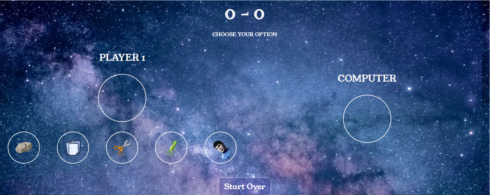
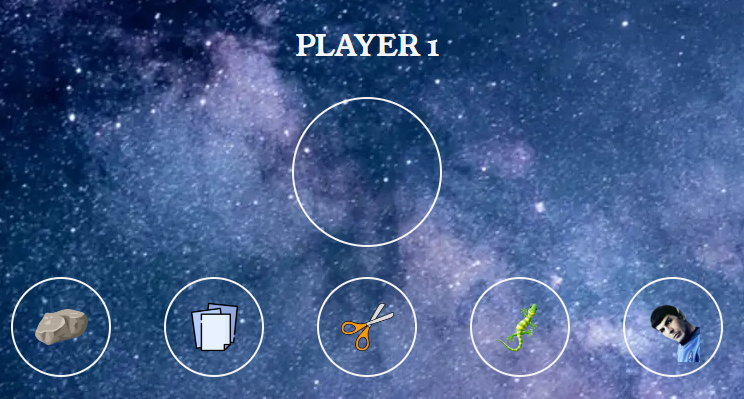
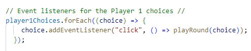
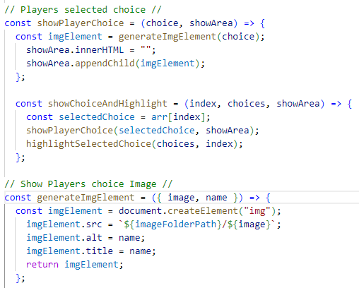
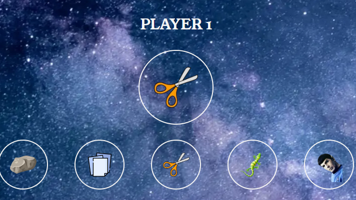
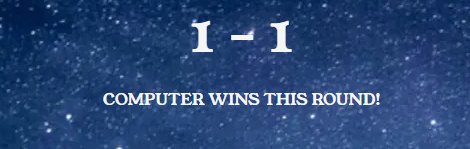
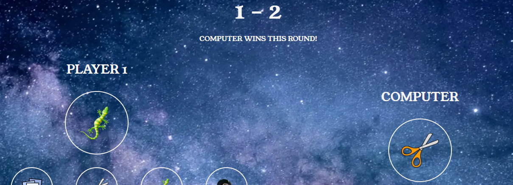

# Rock, Paper, Scissors, Lizard, Spock Javascript Game

# Game purpose

Welcome to the Rock, Paper, Scissors, Lizard, Spock game! This interactive web application is a fun and extended version of the classic Rock, Paper, Scissors game. It adds the elements of Lizard and Spock, making the gameplay more exciting and strategic. The game is built using HTML, CSS, and JavaScript.

The rules are as follows:

- Rock crushes Scissors
- Scissors cuts Paper
- Paper covers Rock
- Rock crushes Lizard
- Lizard poisons Spock
- Spock smashes Scissors
- Scissors decapitates Lizard
- Lizard eats Paper
- Paper disproves Spock
- Spock vaporizes Rock

# How to play

- Open the index.html file in a web browser.
- Choose one of the options (Rock, Paper, Scissors, Lizard, Spock) by clicking on the corresponding button.
- The computer will randomly choose one of the options.
- The winner will be determined based on the game rules.
- The result will be displayed on the screen.

The website has been built using HTML and CSS, and is the final submission for the project#1 section of the Code Institute's Full Stack Developer course.

[The live website can be viewed via this link](https://github.com/Tomboxhall/rock-paper-submit)

---

# UX Design
## User Stories
### As a player of the game

- I want to easily be able to visually understand the purpose of the game.
- I want the play area to be easily recognisable, and kept simplified so as not to have any confusions about what the player needs to do.
- I want the score section to be easily recognised, so the player is able to keep track of their progress against the computer.
- I want the game mechanics to be simply, and for there to not be any bugs that prevent the game from running smoothly.

---

## Structure

The Rock, Paper, Scissors, Lizard, Spock JavaScript game follows a well-organized and modular structure to ensure clarity and maintainability. The project is divided into three main files: **index.html**, **style.css**, and **script.js**. The HTML file (index.html) serves as the entry point, providing the structural foundation for the game interface. It incorporates distinct sections for Player 1, the Computer, and the game results, creating a clean and visually appealing layout.

The styling of the game is handled by the CSS file (style.css). The styles are structured to enhance the user experience, featuring a space-themed background and clear differentiation between player and computer sections. The Player selections also have a **Hover:Grow** effect on them to visually let the player know which choice they are hovering over. 

The core functionality and game logic are encapsulated in the JavaScript file (script.js). The script is well-commented, making it easy to understand and maintain. It includes event listeners for player and computer choices, functions for displaying choices and results, score tracking, and a reset functionality. The use of functions and modular coding principles enhances readability and allows for potential future enhancements.

Overall, the structure of the Rock, Paper, Scissors, Lizard, Spock game follows best practices for web development, promoting maintainability, scalability, and ease of collaboration.

---

## Features

### 1. User Interface

The game provides a user-friendly interface with clear sections for Player 1, the Computer, and the game results. The background is a mesmerizing space-themed image to enhance the gaming experience.

Upon the player landing on the Game home page, they will be met with a visually appeasing game, the Player 1 section is on the left, the computers play area on the right, and a scoreboard at the top and a start over button at the bottom. The design was kept simple, and removed any confusion for the player as to what they have to do to participate.

### 2. Choices

Player 1's choices are presented with clickable images for Rock, Paper, Scissors, Lizard, and Spock.
Computer's choices are also displayed but hidden until Player 1 makes a selection.

The logic behind the Player's choices comprise of an Event listener, and a Function as follows;

This JavaScript code adds click event listeners to elements in the player1Choices array. When one of these elements is clicked, it calls the playRound function with the clicked choice as an argument. The assumption is that player1Choices contains HTML elements representing choices for a game, like buttons, and playRound handles the game logic for the selected choice.

These JavaScript functions work together for displaying and highlighting a player's choice in a web application or game:

1. **showPlayerChoice** Function:
- Takes the player's choice and a display area.
- Uses generateImgElement to create and display an image of the choice in the area.

2. **showChoiceAndHighlight** Function:
- Takes an index, an array of choices, and a display area.
- Displays the selected choice and highlights it among other choices.

3. **generateImgElement** Function:
- Takes an object with image and name.
- Creates an image element with the specified properties.

In short, these functions collaborate to visually present a player's choice, including highlighting it when needed.

Image below to show the outcome of the Function once called upon;

### 3. Score Tracking
The scores for both Player 1 and the Computer are prominently displayed at the top, allowing players to keep track of their performance throughout the game.

The JavaScript function **calculateAndDisplayResult** determines the winner of a game round between a player and a computer. Here's a simplified breakdown:

### 1. Parameters:
- Takes indices representing the player's and computer's choices.

### 2. Choice Retrieval:
- Gets the actual choices (names) made by the player and the computer.

### 3. Comparison and Outcome:
- Checks if the choices are the same; if yes, it's a draw.

If choices are different:

- Determines the strength of the player's choice using predefined rules.
- Checks if the player wins against the computer.
- Updates the score and displays the result message (win, lose).

In short, this function calculates and displays the result of a game round, factoring in draws, player wins, and computer wins based on their choices and predefined rules.

### 4. Real-time Results
The game dynamically updates the chosen options for both Player 1 and the Computer, providing a visual representation of the current round. The result message informs the player of the outcome, whether it's a draw, a win for Player 1, or a win for the Computer.

(Show screenshot example, and any functions related to this)

### 5. Reset Button
A "Start Over" button is available for players to reset the game. This button clears the chosen options, resets the scores, and displays a message prompting the player to make a new selection.

(Show screenshot example, and any functions related to this)

---

## Technologies

- HTML for the structure of the website.
- CSS for styling of the content of the website.
- JS for creating the dynamic and interactive web page to interact with visitors and execute complex actions.
- [Codeanywhere](https://dashboard.codeanywhere.com/) Codeanywhere as the IDE to develop the website on.
- [Github](https://github.com/) Github for hosting the source code, and Github pages for deploying the live site through.
- Git, for commiting and pushing any changes to their code to the repository.
- [Chrome dev tools](https://developer.chrome.com/docs/devtools/) For testing layouts, debugging and general tweaking of the code.
- [Google Fonts](https://fonts.google.com/) Providing the fonts.
- [FontAwesome](https://fontawesome.com/) Providing the Icons.
- [CloudConvert](https://cloudconvert.com/jpg-to-webp) Converting JPG images to WEBP, for better optimisation on the website.
- Google Chrome Lighthouse - To check Accessibility.
- [Toptal](https://www.toptal.com/designers/colorfilter) For checking the Color-blind accessibility.
- [W3C HTML Markup Validator](https://validator.w3.org/) Validate the HTML code of the website.
- [W3C CSS Markup Validator](https://jigsaw.w3.org/css-validator/#validate_by_input) Validate the CSS of the website.
- [Favicon.ico](https://www.favicon.cc/) to generate the Favicon

---

## Automated Testing

HTML

CSS

JS

---

## Manual Testing of Features

---

## Accessibility Testing

### Toptal Colorfilter

### Screen Reader

---

## Deployment

This project was deployed to Github pages, a step by step guide to deploy is as follows:

1. Log into [Github](https://github.com/Tomboxhall/history-of-edinburgh).
2. Choose `history-of-edinburgh` in the list of repositories.
3. Select `settings` in the repositories sub headings along the top.
4. In the left hand side menu, select the `pages` link within the `code and automation` section.
5. Within the branch sub-section, under Build and Deployment select `main` in the dropdown menu.
6. Select the `root` in the dropdown menu to the right.
7. Press `save`
8. Finally a message should appear stating that the website is ready to be deployed, refresh the page, and the link should be available at the top of the page.

---

## Credits

### Media (Image Sourcing)

### Code

### Ackownledgments

---

## Final Comments

---